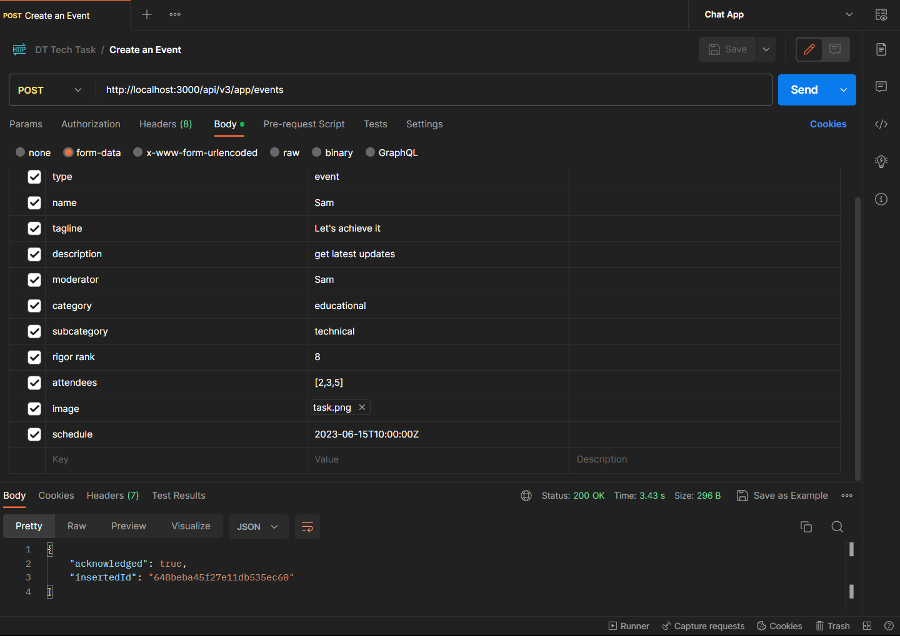
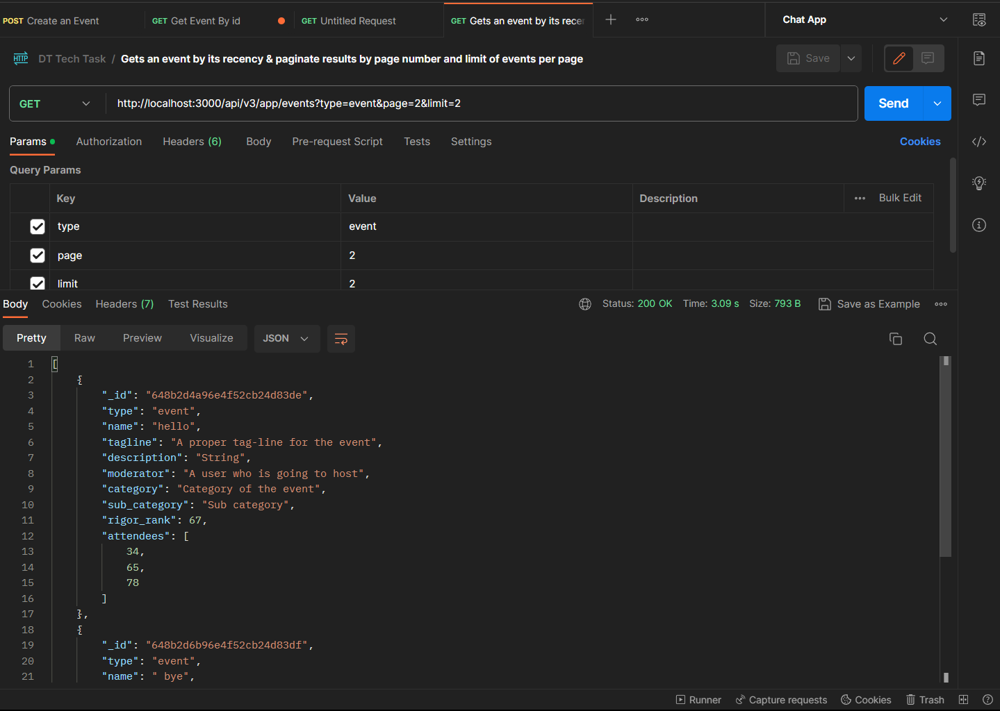
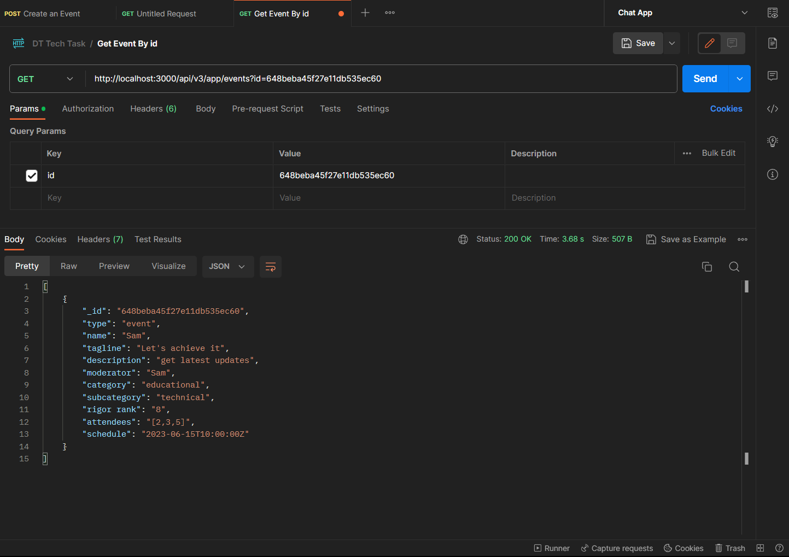
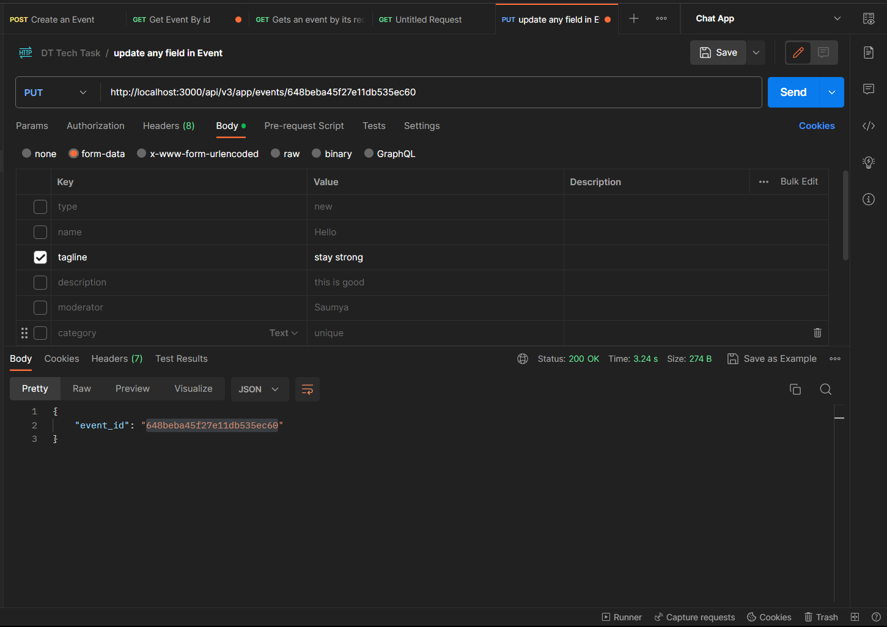
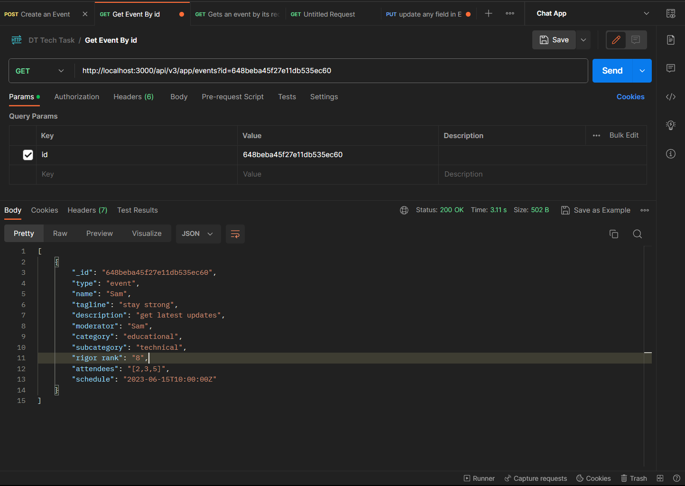
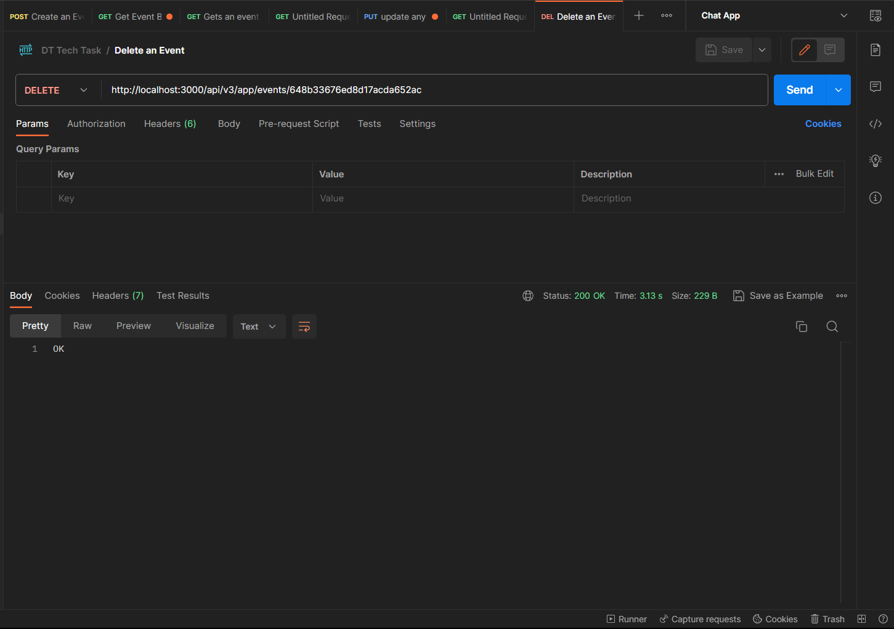
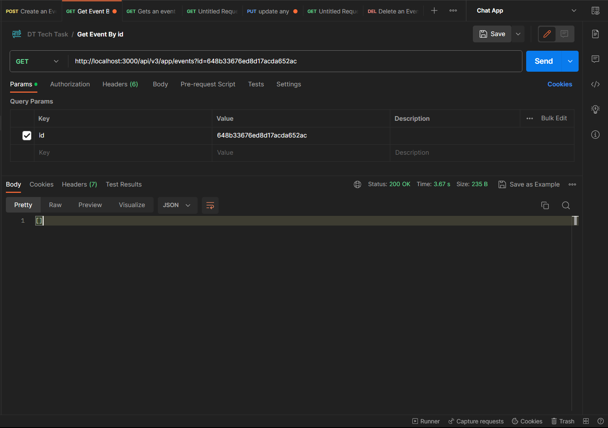

# DT-Tech
#Description
Users can retrieve events by ID, fetch the latest events with pagination, create new events, update existing events, and delete events. The documentation guides users on utilizing these functionalities effectively.

#Api Documentation Link

https://documenter.getpostman.com/view/25071613/2s93sgXqex

## Creates a new event and returns the ID of the created event

Endpoint: `POST /api/v3/app/events`

## Retrieves an event by its unique ID. Use the "event_id" query parameter to specify the ID of the event.

Endpoint: `POST /api/v3/app/events?id=`

## Retrieves the latest events. You can specify the number of events per page using the "limit" query parameter, and navigate through pages using the "page" query parameter.

Endpoint: `POST /api/v3/app/events?page=`

## Updates an existing event specified by its unique ID. Use the "id" parameter in the API endpoint to specify the ID of the event to be updated.

Endpoint: `POST /api/v3/app/events/:id`

## Deletes an event specified by its unique ID. Use the "id" parameter in the API endpoint to specify the ID of the event to be deleted.

Endpoint: `POST /api/v3/app/events/:id`

